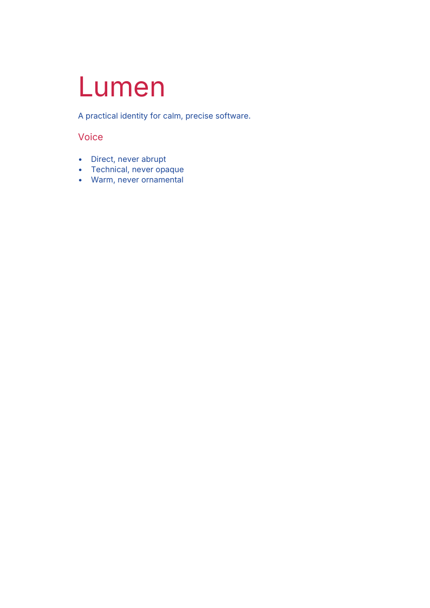
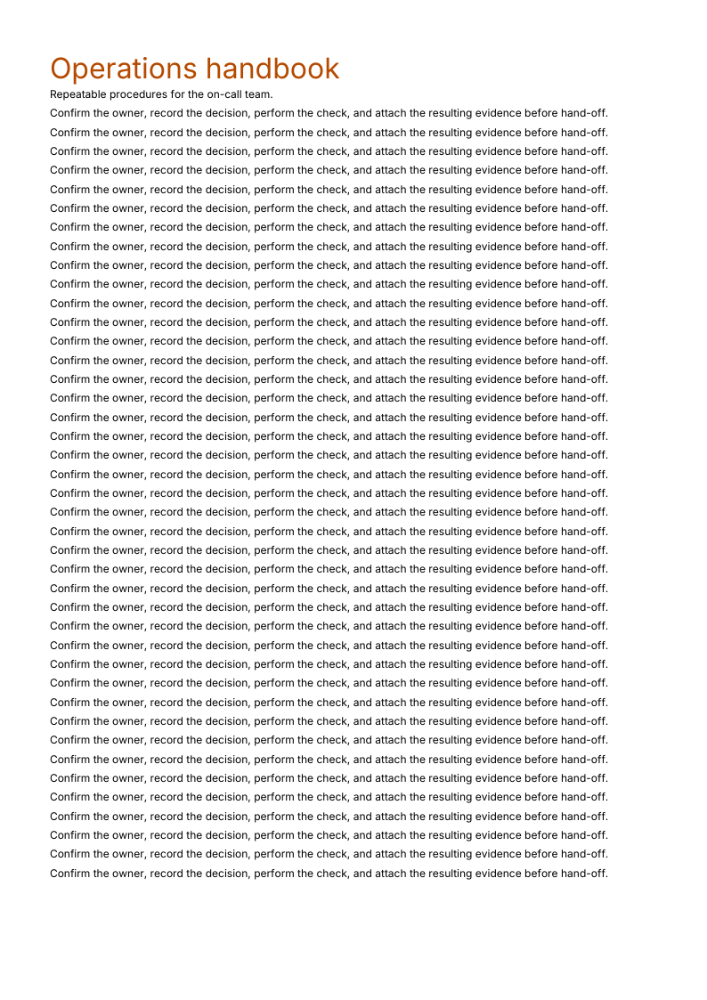
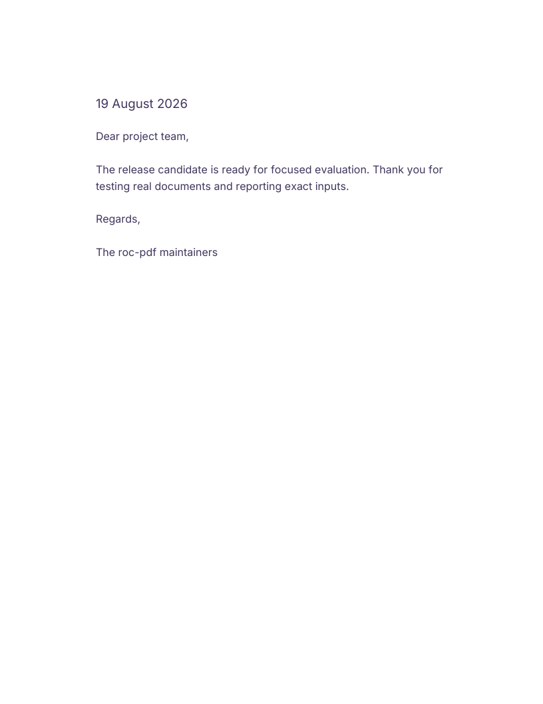
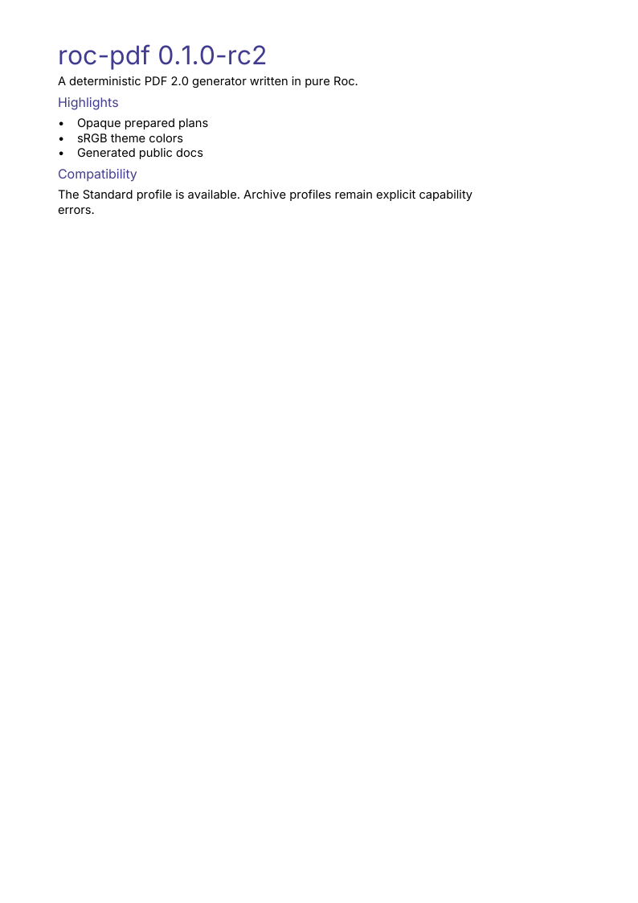
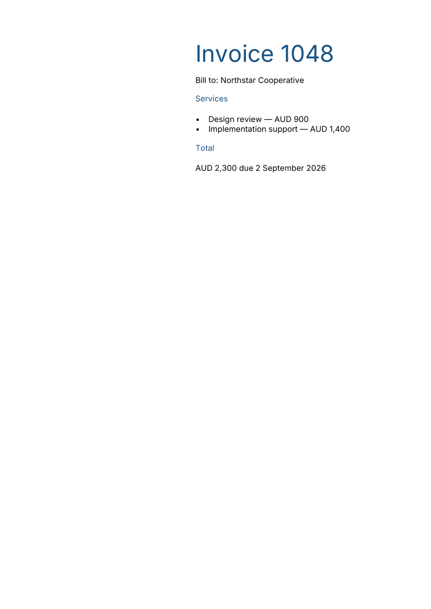
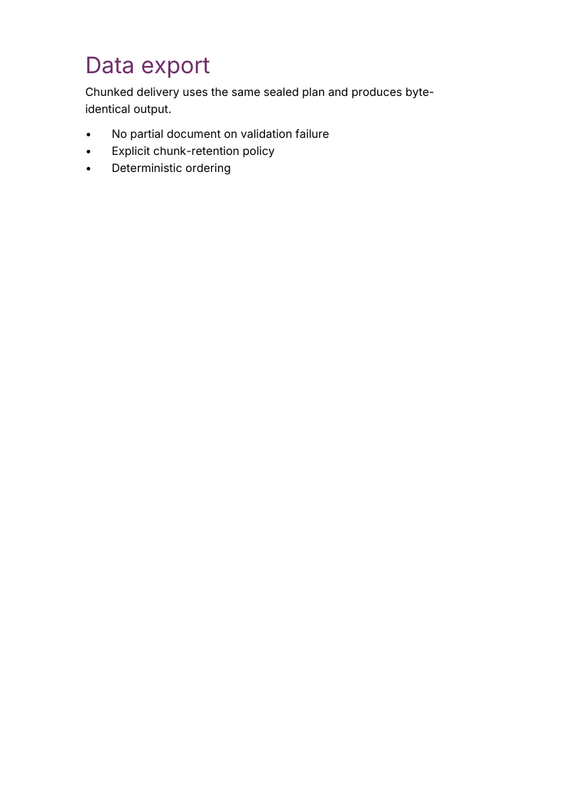
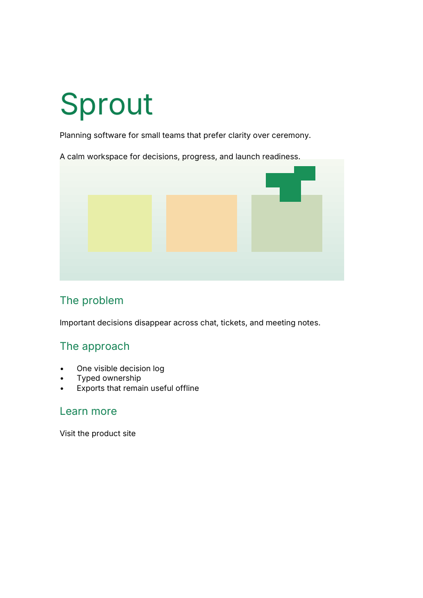

# roc-pdf

An early-development pure [Roc](https://www.roc-lang.org/) package for
deterministic PDF 2.0 generation.

The package offers a stable public authoring path under the `Standard`
profile: `Pdf.to_bytes`, `Pdf.to_bytes_with`, and `Pdf.to_chunks_with` all
produce deterministic tagged PDF 2.0 output, and the buffered and chunked
forms are byte-identical. The built-in theme supports title, heading,
paragraph, and bulleted-list constructors, with either the packaged face or
caller-registered faces selected through `Theme` — including a finite ordered
multi-face policy with per-cluster coverage selection. Theme text colors use
the packaged sRGB profile. Documents can be prepared once into an opaque,
validated plan and then emitted as buffered bytes or chunks. It does not read,
edit, or repair PDFs, and unsupported requests return typed errors rather than
producing blank output, substituting fonts, outlining text, or rasterizing
content.

This is not a PDF/A-4 or PDF/UA-2 package. `Archive` and `AccessibleArchive`
deliberately return structured feature diagnostics, so do not make archival or
accessibility-conformance claims from it. Automatic hyphenation is not
accepted, and the convenience shaping path covers a declared script set;
right-to-left and case-transformation output are available at the advanced
integration boundary rather than through the one-import facade.

The package exposes the high-level `Pdf` facade plus the advanced conceptual
`Document`, `Semantics`, `Layout`, `Scene`, `Text`, `Font`, `Image`, `Color`,
`Metadata`, `Encode`, `Conformance`, and `Theme` boundaries. PDF object,
lowering, and serialization internals are not public.

Typed packed-raster and JPEG sources can now be placed as a meaningful
single-image `Pdf.figure` with required alternative text and an optional
caption. Broader drawings and content-first fixed pages remain available for
early integration; `Pdf.prepare` rejects their unsupported forms atomically
with a stable feature code and roadmap explanation. See the
[authoring support matrix](docs/authoring.md#forward-authoring-api).

The current candidate scope is recorded in [the 0.1.0-rc2 release
notes](docs/releases/0.1.0-rc2.md). Gate 4 is closed; its aggregated evidence is
recorded in the [production-visual closure
review](docs/performance/production-visual-closure.md).

## Start here

- [Authoring guide](docs/authoring.md)
- [Example gallery](examples/README.md)
- [Generated API documentation](https://lukewilliamboswell.github.io/roc-pdf/)
- [Migrating to rc2](docs/migrating-to-rc2.md)

## Examples

Click a preview to open the generated PDF, or its caption to view the complete
runnable Roc source.

<table>
<tr>
<td><a href="examples/quarterly-report.pdf"></a><br><a href="examples/quarterly_report.roc">Quarterly report source</a></td>
<td><a href="examples/brand-brief.pdf"></a><br><a href="examples/brand_brief.roc">Brand brief source</a></td>
<td><a href="examples/field-guide.pdf"></a><br><a href="examples/field_guide.roc">Field guide source</a></td>
</tr>
<tr>
<td><a href="examples/operations-handbook.pdf"></a><br><a href="examples/operations_handbook.roc">Operations handbook source</a></td>
<td><a href="examples/project-letter.pdf"></a><br><a href="examples/letter.roc">Letter source</a></td>
<td><a href="examples/release-notes.pdf"></a><br><a href="examples/release_notes.roc">Release notes source</a></td>
</tr>
<tr>
<td><a href="examples/invoice-1048.pdf"></a><br><a href="examples/prepared_invoice.roc">Prepared invoice source</a></td>
<td><a href="examples/chunked-export.pdf"></a><br><a href="examples/chunked_export.roc">Chunked export source</a></td>
<td><a href="examples/product-brief.pdf"></a><br><a href="examples/product_brief.roc">Product brief source</a></td>
</tr>
</table>

[See what each application demonstrates and how to run it.](examples/README.md)

## Design

- [Architecture](architecture.md)
- [Feature roadmap](feature-roadmap.md)

## Requirements

- Python 3
- Zig 0.16.0
- The Roc nightly pinned in [`.roc-version`](.roc-version), available as `roc` on `PATH`

## Development

Run the complete test suite with the pinned Roc compiler:

```sh
./scripts/test.py
```

See [Testing and fixture development](docs/testing.md) for focused runs,
compiler selection, allocation and snapshot workflows, and the family-fixture
schema.

## License

This project is licensed under the [Universal Permissive License](LICENSE).
