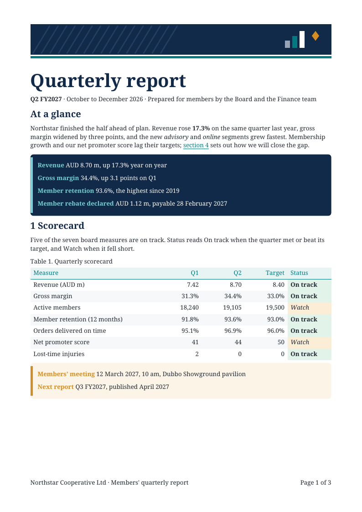
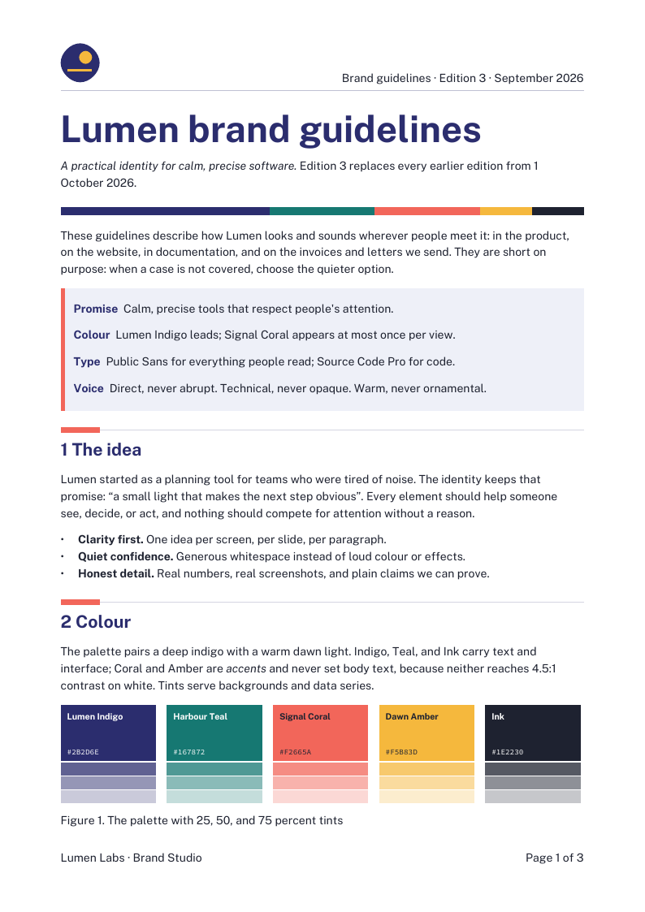
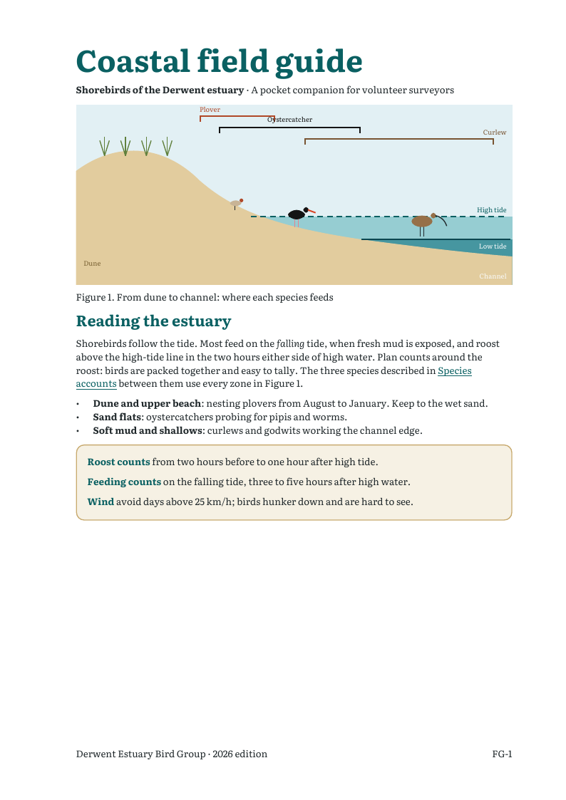
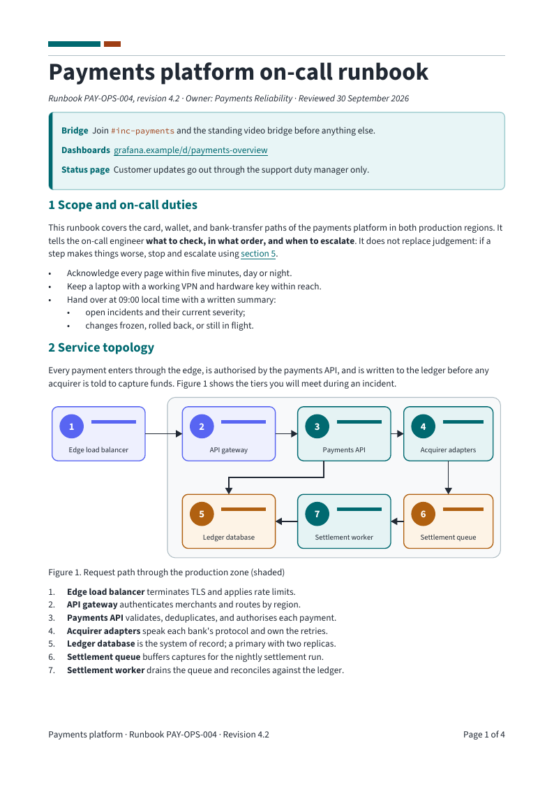
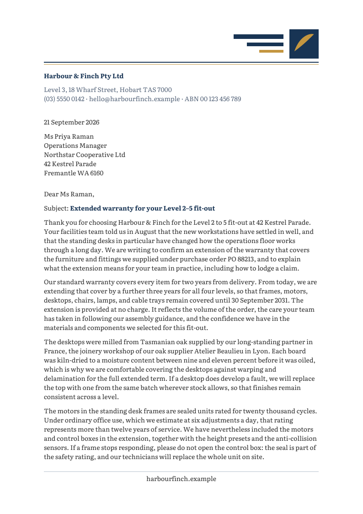
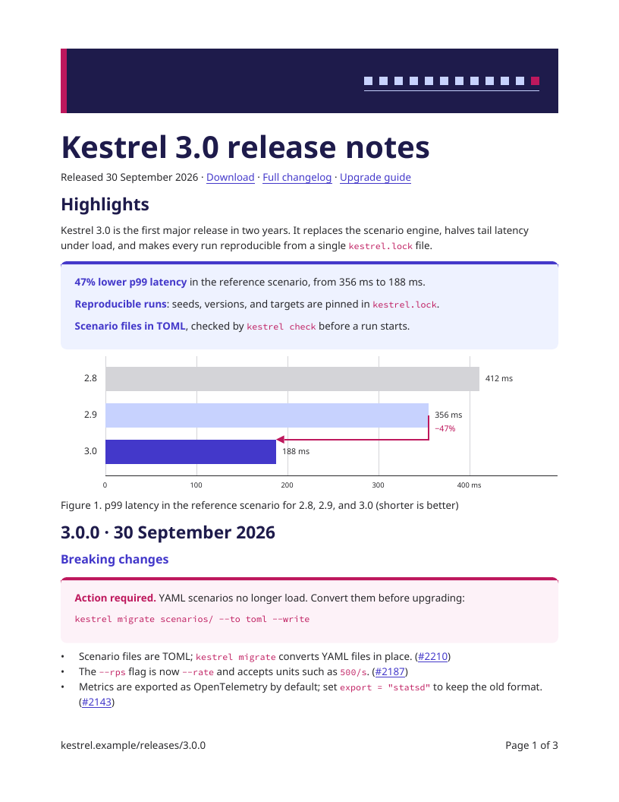
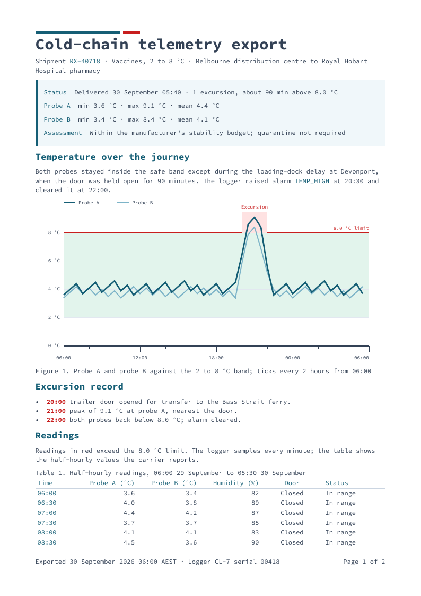
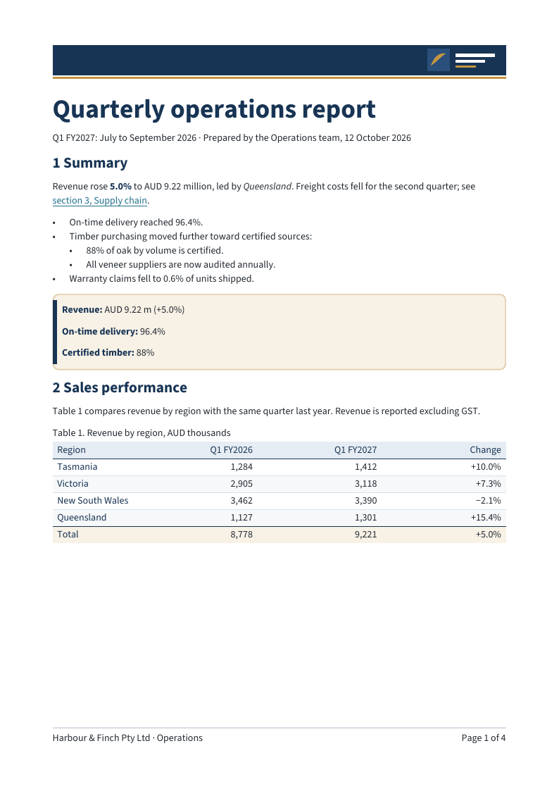

# Example gallery

Each example is a complete [basic-cli 0.23.0](https://github.com/roc-lang/basic-cli/releases/tag/0.23.0)
application that imports the local package. Every example has its own
directory:

```text
examples/<name>/
  main.roc      the application
  <name>.pdf    the PDF it writes
  preview.png   the first page, rendered by pdftoppm at 96 dpi
  fonts/        the fonts it registers, with their license texts
```

Run an example from its directory, where it writes its PDF:

```sh
cd examples/product-brief
roc main.roc
```

An example imports only files inside its own directory, so the directory
works unchanged against the released package bundle once the `pdf`
dependency names the bundle URL. `scripts/check_gallery.py` regenerates
every PDF and checks that it equals the committed bytes, and with
`--bundle-path` it does the same against a served bundle.

<table>
<tr>
<td><a href="quarterly-report/quarterly-report.pdf"></a><br><a href="quarterly-report/main.roc">Quarterly report source</a></td>
<td><a href="brand-brief/brand-brief.pdf"></a><br><a href="brand-brief/main.roc">Brand brief source</a></td>
<td><a href="field-guide/field-guide.pdf"></a><br><a href="field-guide/main.roc">Field guide source</a></td>
</tr>
<tr>
<td><a href="operations-handbook/operations-handbook.pdf"></a><br><a href="operations-handbook/main.roc">Operations handbook source</a></td>
<td><a href="warranty-letter/warranty-letter.pdf"></a><br><a href="warranty-letter/main.roc">Business letter source</a></td>
<td><a href="release-notes/release-notes.pdf"></a><br><a href="release-notes/main.roc">Release notes source</a></td>
</tr>
<tr>
<td><a href="tax-invoice/tax-invoice.pdf"></a><br><a href="tax-invoice/main.roc">Tax invoice source</a></td>
<td><a href="chunked-export/chunked-export.pdf"></a><br><a href="chunked-export/main.roc">Chunked export source</a></td>
<td><a href="product-brief/product-brief.pdf"></a><br><a href="product-brief/main.roc">Product brief source</a></td>
</tr>
<tr>
<td><a href="business-report/business-report.pdf"></a><br><a href="business-report/main.roc">Business report source</a></td>
</tr>
</table>

| Example | Typefaces | What it demonstrates |
| --- | --- | --- |
| [Quarterly report](quarterly-report/main.roc) | Noto Serif | a members' report for a regional cooperative: a cover band in the first-page header with its mark placed as a group, a navy key-figures callout in white text and a tinted diary callout, both measured by the package, a striped KPI scorecard with tinted status cells, a monthly revenue table beside its chart, and a segment table with a shaded totals footer, two labelled vector charts built from `Scene` groups (the targets chart kept with its notes), and running headers inset above a hairline backdrop with `Page N of M` |
| [Brand brief](brand-brief/main.roc) | Public Sans, Source Code Pro | brand guidelines: headers inset above a region backdrop rule beside the mark and edition line, a palette strip and section bands as spaced decorations, measured "At a glance" callouts on a Mist panel and in white on Indigo, vector figures of named colour swatches and logo placements, tables with shaded headers, hairline body rules, and shaded spanning group rows, rich inline content, lists, links, and an outline over named destinations |
| [Field guide](field-guide/main.roc) | Literata | a pocket guide to estuary shorebirds: a labelled vector habitat cross-section and named bird plates, species accounts that are outline destinations and cross-reference one another, identification lists, a survey sheet kept whole on one page (a details table and a checklist, ruled between columns and framed, whose blank cells are empty `TD`s for the surveyor), measured callouts whose lines wrap, spaced dividers, page labels, and running furniture inset above a ruled backdrop |
| [Operations handbook](operations-handbook/main.roc) | Source Sans 3, Source Code Pro | an on-call runbook: `Page N of M` furniture, an outline over numbered sections, severity and escalation tables with tinted severity levels, striped rows, and hairline rules, numbered procedures with nested steps and inline commands, measured warning and note callouts and dark command panels with light code, a vector service-topology diagram with named tiers, and appendices of commands (whose hyphenated flags never break) and procedure drills (an undrilled procedure leaves its cell empty) |
| [Business letter](warranty-letter/main.roc) | Literata | the reference business letter: a letterhead whose mark sits above a navy and brass rule as furniture, with the sender's name in Bold and address in slate as semantic blocks in the first-page lead region, a centered footer below a hairline, continuation headers with `Page N of M` inset above a hairline, an unsplittable signature block, an italic enclosure title, and an explicit break before a shaded, ruled covered-items schedule; no visible title, with the metadata title displayed |
| [Release notes](release-notes/main.roc) | Noto Sans, Source Code Pro | release notes on US Letter: a decorative version banner spaced from the title, a night-blue highlights callout and a breaking-change callout, both measured by the package, versioned sections in the outline, change lists with inline code and underlined issue links, a labelled latency chart, a striped compatibility table with strong new versions and a table of changed flags, both leaving a release's missing entry as an empty cell, and running furniture |
| [Business report](business-report/main.roc) | Source Sans 3, Source Code Pro | the reference business report: a navy cover band with the reversed mark, outline and link destinations for numbered sections, rich inline content with expansions, code, and a French quotation, nested lists, a "Key figures" callout with Bold labels through the custom-block seam (measured by the extension), a captioned bar chart whose axis values, bar values, region names, and legend are real drawing labels, a captioned JPEG photograph, a revenue table with a shaded total, and a striped 40-row register that continues with its header repeated |
| [Tax invoice](tax-invoice/main.roc) | Source Sans 3 | the reference multi-page invoice: a vector logo over a navy and brass masthead rule, continuation headers inset above a hairline and footers below one with exact `Page N of M`, a striped key/value table, a 32-row items table with white-on-navy column headers, striped and ruled rows, a repeated header, and a totals group on a brass tint, and prepare-once emission |
| [Chunked export](chunked-export/main.roc) | Source Code Pro | a cold-chain telemetry export emitted incrementally with `Pdf.to_chunks_prepared`: a measured summary callout, a generated temperature chart with axis labels, a legend, and its safe band, and a 48-row readings table with zebra rows and shaded excursions that continues across pages with its header repeated and a shaded summary footer |
| [Product brief](product-brief/main.roc) | Inter, Source Code Pro | a US Letter launch brief: a vector hero illustration with labelled columns, a measured key-figures callout and a customer quote in white on forest green, a labelled line chart with its data table, a plan comparison table kept whole on one page with shaded group rows, empty cells for capabilities a plan lacks, and a price footer, a support table, rich inline content with code, lists, links, `Page N of M` furniture over ruled backdrops, and an outline |

The applications vary information architecture, lifecycle, navigation, page
format, and visual theme. The business report, business letter, and tax
invoice are the reference documents of
[docs/reference-documents.md](../docs/reference-documents.md); the
`tests/reference_documents` family prepares the same documents, with the
same fonts from these directories, and checks that their bytes equal the
committed PDFs here. Every example registers its fonts through the public font
registry (`Font.Registry.register`) and selects a Bold, Italic, or monospace
face per inline role through the theme's `inline` record, a Bold face for
the title and headings through `title` and `headings` (level-1 and level-2
headings are `Own` styles in several), and scale inline code to the body
text with `inline: { code: { scale: Percent(90) } }`. Each example's theme
is one record, `theme(faces)`, that names only what differs from the
built-in values, with sizes as literal points. Links take a colour and an
underline from the theme's `link` record. Their charts,
illustrations, and diagrams are vector drawings built from `Scene` groups
with real, searchable text labels (`Scene.Drawing.text`, or
`Scene.Drawing.text_in` for a label in the bold or code face, such as the
brand brief's swatch names and hex values), and the business
report places a JPEG photograph as an accessible figure with authored
alternative text and a caption. Tables are shaded and ruled through
the theme's `table` record (`header_fill`, `body_fills`, `footer_fill`,
`body_rule`, and, in the field guide, `column_rule` and `frame`), with
single cells tinted by `cell.shaded(color)`, and row header cells keep the
body colour unless `row_header_color` sets one. A cell the table leaves
blank is `Pdf.cell([])`, an empty `TD` with no content, never a dash.
Code spans keep their words whole, so a hyphenated flag never breaks
across lines. Callouts size themselves with
`Pdf.measure_custom_content`, so their paragraphs may wrap, and a scope's
`Text` colour sets light text on a dark panel. Header rules sit in a
region `backdrop` beside the slots' furniture, with the header text
lifted clear of the rule by the region's `slot_inset`, and dividers and
banners keep their gaps through a decoration's `above` and `below`.

Fonts are retained byte-for-byte from their upstream releases under OFL-1.1;
[vendor/README.md](../vendor/README.md) records each archive, and
`assets/provenance.json` records each file.
